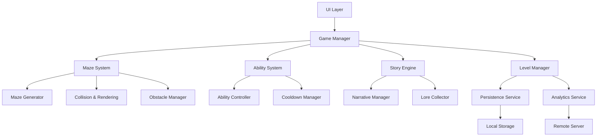

# Design Document

## Overview

Chain-Ledge: Maze of the Lost Spirit is a puzzle-adventure game built around a modular architecture that separates core systems: maze generation, character control, ability management, narrative progression, and player persistence. The design emphasizes maintainability, testability, and extensibility to support future content additions and platform expansions.

The system uses an entity-component architecture for the ghost character and maze elements, a state machine for game flow management, and a hybrid maze generation approach combining procedural algorithms with handcrafted templates. The design prioritizes performance on mobile devices while maintaining code quality through clear separation of concerns.

## Architecture

### High-Level Architecture



### System Layers

1. **Presentation Layer**: UI components, input handlers, rendering
2. **Game Logic Layer**: Core gameplay systems (maze, abilities, story)
3. **Service Layer**: Persistence, analytics, monetization
4. **Data Layer**: Local storage, remote services

### Key Design Patterns

- **Entity-Component System**: Ghost character and maze objects use component composition
- **State Machine**: Game flow (menu → gameplay → story → level complete)
- **Observer Pattern**: Event system for ability usage, level completion, collectible pickup
- **Factory Pattern**: Maze generation, obstacle creation, ability instantiation
- **Strategy Pattern**: Different maze types implement common interface with varying algorithms
- **Command Pattern**: Player input and ability activation

## Components and Interfaces

### Ghost Character Component

```typescript
interface GhostCharacter {
  position: Vector2D;
  velocity: Vector2D;
  abilities: AbilitySet;
  inventory: Inventory;
  
  move(direction: Direction): void;
  useAbility(abilityType: AbilityType): boolean;
  collectItem(item: Collectible): void;
  reset(): void;
}

interface AbilitySet {
  phase: PhaseAbility;
  possess: PossessAbility;
  sense: SenseAbility;
  speedBoost: SpeedBoostAbility;
}

interface Ability {
  charges: number;
  maxCharges: number;
  cooldownMs: number;
  isActive: boolean;
  
  activate(): boolean;
  deactivate(): void;
  canUse(): boolean;
  addCharge(): void;
}
```

### Maze System Component

```typescript
interface MazeSystem {
  currentMaze: Maze;
  ghostCharacter: GhostCharacter;
  
  initialize(levelConfig: LevelConfig): void;
  update(deltaTime: number): void;
  render(): void;
  checkCollisions(): CollisionResult[];
  isExitReached(): boolean;
}

interface Maze {
  type: MazeType;
  grid: Cell[][];
  width: number;
  height: number;
  layers: number;
  entrance: Vector2D;
  exit: Vector2D;
  obstacles: Obstacle[];
  collectibles: Collectible[];
  
  getCell(position: Vector2D): Cell;
  isWalkable(position: Vector2D): boolean;
  isSolvable(): boolean;
}

enum MazeType {
  LINEAR,
  MULTI_LAYERED,
  TIME_CHANGING,
  SHADOW,
  MEMORY
}

interface Cell {
  position: Vector2D;
  type: CellType;
  walls: WallSet;
  isVisible: boolean;
  isRevealed: boolean;
}

enum CellType {
  EMPTY,
  WALL,
  PHASING_WALL,
  PUZZLE_DOOR,
  CHECKPOINT
}
```

### Maze Generator Component

```typescript
interface MazeGenerator {
  generate(config: MazeConfig): Maze;
  validate(maze: Maze): boolean;
}

interface MazeConfig {
  type: MazeType;
  difficulty: number;
  width: number;
  height: number;
  layers: number;
  obstacleCount: number;
  collectibleCount: number;
  template?: MazeTemplate;
}

interface MazeTemplate {
  id: string;
  grid: Cell[][];
  puzzleElements: PuzzleElement[];
}

// Concrete implementations
class ProceduralMazeGenerator implements MazeGenerator {
  // Uses algorithms like recursive backtracking, Prim's, or Kruskal's
}

class HybridMazeGenerator implements MazeGenerator {
  // Combines procedural generation with handcrafted templates
}
```

### Ability System Component

```typescript
interface AbilitySystem {
  activeAbilities: Map<AbilityType, Ability>;
  cooldownManager: CooldownManager;
  
  activateAbility(type: AbilityType, context: AbilityContext): boolean;
  updateCooldowns(deltaTime: number): void;
  addCharge(type: AbilityType): void;
  getAbilityStatus(type: AbilityType): AbilityStatus;
}

interface AbilityContext {
  ghostPosition: Vector2D;
  targetObject?: GameObject;
  maze: Maze;
}

interface CooldownManager {
  cooldowns: Map<AbilityType, number>;
  
  startCooldown(type: AbilityType, durationMs: number): void;
  update(deltaTime: number): void;
  isReady(type: AbilityType): boolean;
  getRemainingTime(type: AbilityType): number;
}
```

### Story Engine Component

```typescript
interface StoryEngine {
  currentChapter: number;
  unlockedMemories: Memory[];
  loreCollection: LoreItem[];
  
  unlockMemory(levelId: string): Memory;
  addLoreItem(item: LoreItem): void;
  displayNarrative(memory: Memory): void;
  skipNarrative(): void;
  isChapterComplete(): boolean;
}

interface Memory {
  id: string;
  chapterNumber: number;
  title: string;
  content: string;
  cinematicData?: CinematicData;
}

interface LoreItem {
  id: string;
  title: string;
  description: string;
  unlockCondition: string;
}
```

### Level Manager Component

```typescript
interface LevelManager {
  currentLevel: number;
  currentChapter: number;
  levelProgress: Map<string, LevelProgress>;
  
  loadLevel(levelId: string): LevelConfig;
  completeLevel(levelId: string, stats: LevelStats): void;
  unlockNextLevel(): void;
  saveProgress(): void;
  loadProgress(): void;
  getDifficultyMultiplier(): number;
}

interface LevelProgress {
  levelId: string;
  completed: boolean;
  attempts: number;
  bestTime: number;
  hintsUsed: number;
  collectiblesFound: number;
}

interface LevelStats {
  completionTime: number;
  hintsUsed: number;
  abilitiesUsed: Map<AbilityType, number>;
  deaths: number;
}
```

### Hint System Component

```typescript
interface HintSystem {
  cooldownMs: number;
  lastHintTime: number;
  availableCharges: number;
  
  requestHint(context: HintContext): Hint | null;
  addCharge(): void;
  canProvideHint(): boolean;
  getRemainingCooldown(): number;
}

interface HintContext {
  currentMaze: Maze;
  ghostPosition: Vector2D;
  unsolvedPuzzles: PuzzleElement[];
}

interface Hint {
  type: HintType;
  targetPosition?: Vector2D;
  message: string;
  highlightDuration: number;
}

enum HintType {
  DIRECTIONAL,
  PUZZLE_CLUE,
  ABILITY_SUGGESTION,
  COLLECTIBLE_LOCATION
}
```

### Persistence Service

```typescript
interface PersistenceService {
  save(key: string, data: any): Promise<boolean>;
  load(key: string): Promise<any>;
  delete(key: string): Promise<boolean>;
  exists(key: string): Promise<boolean>;
}

interface GameSaveData {
  version: string;
  timestamp: number;
  levelProgress: Map<string, LevelProgress>;
  currentLevel: string;
  currentChapter: number;
  unlockedMemories: string[];
  loreCollection: string[];
  inventory: InventoryData;
  cosmetics: CosmeticData;
  settings: GameSettings;
}
```

### Analytics Service

```typescript
interface AnalyticsService {
  trackEvent(event: AnalyticsEvent): void;
  trackLevelComplete(levelId: string, stats: LevelStats): void;
  trackAbilityUsage(abilityType: AbilityType, context: string): void;
  trackHintRequest(levelId: string, hintType: HintType): void;
  flush(): Promise<void>;
}

interface AnalyticsEvent {
  eventType: string;
  timestamp: number;
  properties: Map<string, any>;
}
```

## Data Models

### Core Data Structures

```typescript
interface Vector2D {
  x: number;
  y: number;
}

interface WallSet {
  north: boolean;
  south: boolean;
  east: boolean;
  west: boolean;
}

interface Obstacle {
  id: string;
  type: ObstacleType;
  position: Vector2D;
  patrolPath?: Vector2D[];
  isActive: boolean;
}

enum ObstacleType {
  PHANTOM_GUARD,
  CURSED_TRAP,
  MOVING_WALL,
  TIMED_BARRIER
}

interface Collectible {
  id: string;
  type: CollectibleType;
  position: Vector2D;
  isCollected: boolean;
}

enum CollectibleType {
  CLUE,
  LORE_ITEM,
  ABILITY_CHARGE,
  COSMETIC_UNLOCK
}

interface PuzzleElement {
  id: string;
  type: PuzzleType;
  position: Vector2D;
  isSolved: boolean;
  requiredItems: string[];
  unlocksPath: Vector2D[];
}

enum PuzzleType {
  POSSESSION_PUZZLE,
  SEQUENCE_PUZZLE,
  TIMING_PUZZLE,
  COLLECTION_PUZZLE
}
```

### Configuration Data

```typescript
interface GameConfig {
  targetFPS: number;
  inputResponseTimeMs: number;
  autoSaveIntervalMs: number;
  maxLoadTimeMs: number;
  
  abilities: AbilityConfig[];
  mazeTypes: MazeTypeConfig[];
  difficultySettings: DifficultyConfig;
}

interface AbilityConfig {
  type: AbilityType;
  maxCharges: number;
  cooldownMs: number;
  durationMs: number;
  cost: number;
}

interface DifficultyConfig {
  baseComplexity: number;
  complexityIncreaseRate: number;
  adaptiveThreshold: number;
  hintCooldownMs: number;
}
```

## Correctness Properties

*A property is a characteristic or behavior that should hold true across all valid executions of a system—essentially, a formal statement about what the system should do. Properties serve as the bridge between human-readable specifications and machine-verifiable correctness guarantees.*


### Movement and Collision Properties

Property 1: Input-driven movement consistency
*For any* valid directional input and ghost character state, providing input should move the ghost in the specified direction at consistent speed, and releasing input should immediately stop movement.
**Validates: Requirements 1.1, 1.4**

Property 2: Wall collision prevention
*For any* maze configuration and ghost position, attempting to move into a solid wall without phase ability active should prevent movement through that wall.
**Validates: Requirements 1.3**

Property 3: Collision detection during movement
*For any* movement path and collectible position, if the ghost moves through a collectible's position, the collectible should be added to inventory.
**Validates: Requirements 1.5, 4.1**

### Ability System Properties

Property 4: Phase ability wall penetration
*For any* phasing wall and ghost character with available phase charges, activating phase ability should allow passage through the wall for the ability duration.
**Validates: Requirements 2.1**

Property 5: Possession control transfer
*For any* valid possessable object, activating possession ability should transfer control to that object and enable its puzzle-solving interactions.
**Validates: Requirements 2.2**

Property 6: Sense ability revelation
*For any* maze with hidden elements, activating sense ability should make all hidden routes and clues within range visible.
**Validates: Requirements 2.3**

Property 7: Speed boost effect
*For any* ghost character state, activating speed boost should increase movement speed by the configured multiplier for the ability duration.
**Validates: Requirements 2.4**

Property 8: Ability charge and cooldown management
*For any* ability with available charges, using the ability should decrement charges by one and start the cooldown timer, and when cooldown completes, charges should increase by one.
**Validates: Requirements 2.5, 2.6**

### Maze Generation Properties

Property 9: Maze solvability guarantee
*For any* generated maze configuration, there must exist at least one valid path from the entrance to the exit.
**Validates: Requirements 3.2**

Property 10: Difficulty progression
*For any* two consecutive levels where level B follows level A, the complexity metrics (obstacles, layers, puzzle count) of level B should be greater than or equal to level A.
**Validates: Requirements 3.3**

Property 11: Memory maze path removal
*For any* memory maze and ghost position, cells that the ghost has moved away from should become invisible after a configured delay.
**Validates: Requirements 3.4**

Property 12: Shadow maze visibility constraint
*For any* shadow maze and ghost position, only cells within the configured visibility radius should be visible.
**Validates: Requirements 3.5**

Property 13: Multi-layer navigation
*For any* multi-layered maze with layer transition points, using a transition should update the current layer and render the new layer's cells.
**Validates: Requirements 3.6**

### Puzzle and Progression Properties

Property 14: Puzzle solution unlocks paths
*For any* puzzle element with associated locked paths, solving the puzzle should make all associated paths walkable.
**Validates: Requirements 4.2**

Property 15: Exit activation condition
*For any* level with required puzzles, the portal exit should only become active when all required puzzles are solved.
**Validates: Requirements 4.3**

Property 16: Level completion triggers progression
*For any* level, when the ghost reaches the active portal exit, the level should be marked as complete and the next level should be unlocked.
**Validates: Requirements 4.4, 8.1**

### Story and Narrative Properties

Property 17: Memory unlock on level completion
*For any* completed level, the story engine should unlock the corresponding memory fragment and add it to the unlocked memories collection.
**Validates: Requirements 5.1**

Property 18: Collection addition
*For any* collectible item (lore, cosmetic, ability charge), collecting or unlocking the item should add it to the appropriate collection and make it accessible.
**Validates: Requirements 5.2, 9.1**

Property 19: Chapter completion triggers cutscene
*For any* chapter, when all levels in the chapter are completed, the story engine should trigger the chapter cutscene.
**Validates: Requirements 5.3**

Property 20: Gameplay pause during narrative
*For any* active narrative display, the game state should be paused and player movement/abilities should be disabled.
**Validates: Requirements 5.4**

### Hint System Properties

Property 21: Hint availability after cooldown
*For any* hint request, if the cooldown has elapsed and charges are available, the hint system should provide a contextual hint and start a new cooldown.
**Validates: Requirements 6.1, 6.2**

Property 22: Ad reward grants hint charge
*For any* completed reward advertisement, the hint system should immediately add one hint charge to available charges.
**Validates: Requirements 6.3**

### Obstacle and Threat Properties

Property 23: Guard patrol path following
*For any* phantom guard with a defined patrol path, the guard should move along the path in sequence, returning to the start after reaching the end.
**Validates: Requirements 7.1**

Property 24: Guard collision resets position
*For any* collision between ghost and phantom guard, the ghost position should be reset to the most recent checkpoint or maze entrance.
**Validates: Requirements 7.2**

Property 25: Trap activation applies effects
*For any* cursed trap, when the ghost triggers the trap, the trap's configured effect (cooldown increase, movement restriction) should be applied to the ghost.
**Validates: Requirements 7.3, 7.4**

### Progression and Persistence Properties

Property 26: Chapter progression
*For any* chapter, when all levels in the chapter are completed, the next chapter should be unlocked and accessible.
**Validates: Requirements 8.2**

Property 27: Level list accuracy
*For any* level selection interface state, the displayed levels should exactly match the set of unlocked levels in the player's progression data.
**Validates: Requirements 8.3**

Property 28: Save/load round trip
*For any* game state, saving the state to storage and then loading it should restore an equivalent game state with all progression, inventory, and settings preserved.
**Validates: Requirements 8.4, 11.1, 11.2, 11.3**

Property 29: Session metrics tracking
*For any* gameplay session, the level manager should record time spent, attempts per level, and ability usage for analytics.
**Validates: Requirements 8.5**

Property 30: Auto-save interval
*For any* gameplay session longer than the auto-save interval, the game should perform automatic saves at the configured interval.
**Validates: Requirements 11.5**

Property 31: Save retry on failure
*For any* failed save operation, the system should retry the save operation up to the configured retry limit before notifying the player.
**Validates: Requirements 11.4**

### Cosmetic System Properties

Property 32: Cosmetic application
*For any* selected cosmetic skin, the ghost character should render with that skin's visual appearance in all subsequent gameplay.
**Validates: Requirements 9.2**

Property 33: Cosmetic gameplay neutrality
*For any* two different cosmetic skins, all ability behaviors and movement mechanics should function identically regardless of which skin is applied.
**Validates: Requirements 9.3**

Property 34: Cosmetic list accuracy
*For any* customization interface state, the displayed cosmetics should exactly match the set of unlocked cosmetics in the player's collection.
**Validates: Requirements 9.4**

### Analytics Properties

Property 35: Event logging completeness
*For any* significant game event (level completion, ability usage, hint request), the analytics service should log the event with timestamp and relevant context data.
**Validates: Requirements 12.1, 12.2, 12.3**

Property 36: Analytics data transmission
*For any* collected analytics data, the system should aggregate and transmit the data to the analytics service within the configured flush interval.
**Validates: Requirements 12.4**

### Audio System Properties

Property 37: Event-triggered audio playback
*For any* game event with associated audio (ability activation, environmental event, maze type change), the audio system should play the corresponding sound effect or music.
**Validates: Requirements 13.1, 13.2, 13.3**

### Monetization Properties

Property 38: Shop inventory accuracy
*For any* shop interface state, the displayed items should include all available cosmetics, ability bundles, and chapter unlocks with correct pricing.
**Validates: Requirements 14.1**

Property 39: Purchase fulfillment
*For any* completed purchase, the purchased items should be immediately added to the player's inventory and persisted to storage.
**Validates: Requirements 14.2**

Property 40: Core content accessibility
*For any* level in the core progression path, the level should be accessible without requiring any purchases.
**Validates: Requirements 14.3**

Property 41: Ad reward fulfillment
*For any* completed reward advertisement, the advertised reward (hints, ability charges) should be immediately granted to the player.
**Validates: Requirements 14.4**

### Adaptive Difficulty Properties

Property 42: Failure-triggered difficulty assistance
*For any* level, if the player fails the level more than the configured threshold, the system should offer optional difficulty adjustments.
**Validates: Requirements 15.1**

Property 43: Performance-based difficulty scaling
*For any* player with high performance metrics (fast completion, low hint usage), the difficulty progression rate should be maintained or increased.
**Validates: Requirements 15.2**

Property 44: Difficulty adjustment scope
*For any* accepted difficulty adjustment, the adjustment should only affect the current level and should not persist to subsequent levels.
**Validates: Requirements 15.4**

Property 45: Skill level analysis
*For any* gameplay session, the system should analyze completion time, hint usage, and attempt count to calculate a skill level metric.
**Validates: Requirements 15.5**

## Error Handling

### Error Categories

1. **Input Errors**: Invalid movement commands, ability activation without charges
2. **State Errors**: Attempting actions in invalid game states (e.g., moving during narrative)
3. **Persistence Errors**: Save/load failures, storage quota exceeded
4. **Network Errors**: Analytics transmission failures, ad loading failures
5. **Generation Errors**: Maze generation producing unsolvable mazes
6. **Resource Errors**: Asset loading failures, memory constraints

### Error Handling Strategies

**Graceful Degradation**:
- If analytics transmission fails, queue events locally and retry
- If ad loading fails, allow gameplay to continue without reward
- If cosmetic assets fail to load, use default ghost appearance

**User Notification**:
- Display clear error messages for save failures with retry options
- Notify players when network features are unavailable
- Provide feedback when purchases fail with support contact

**Automatic Recovery**:
- Retry failed save operations with exponential backoff
- Regenerate mazes if solvability validation fails
- Reset to checkpoint on invalid game state detection

**Validation**:
- Validate all player inputs before processing
- Verify maze solvability before presenting to player
- Check ability preconditions before activation
- Validate save data integrity before loading

**Logging**:
- Log all errors with context for debugging
- Track error frequency for quality monitoring
- Include device info and game state in error reports

### Critical Error Handling

For unrecoverable errors:
1. Save current game state if possible
2. Display user-friendly error message
3. Provide option to restart from last checkpoint
4. Log detailed error information for analysis
5. Offer support contact information

## Testing Strategy

### Unit Testing

**Core Logic Tests**:
- Maze generation algorithms produce valid grids
- Pathfinding correctly identifies solvable mazes
- Collision detection accurately identifies overlaps
- Ability cooldown timers decrement correctly
- Save/load serialization preserves data integrity

**Component Tests**:
- Ghost character movement responds to input
- Ability system manages charges and cooldowns
- Story engine unlocks memories on level completion
- Level manager tracks progression accurately
- Hint system respects cooldown periods

**Edge Cases**:
- Empty maze handling
- Maximum ability charges
- Minimum visibility radius (shadow maze)
- Zero collectibles in level
- Simultaneous collision events

### Property-Based Testing

**Testing Framework**: We will use **fast-check** for JavaScript/TypeScript property-based testing.

**Configuration**: Each property-based test should run a minimum of 100 iterations to ensure adequate coverage of the input space.

**Test Tagging**: Each property-based test MUST include a comment tag in this format:
```typescript
// Feature: chain-ledge-game, Property X: [property description]
```

**Property Test Coverage**:
- Each correctness property listed in this document MUST be implemented as a SINGLE property-based test
- Property tests verify universal behaviors across randomly generated inputs
- Property tests complement unit tests by covering the input space comprehensively

**Example Property Test Structure**:
```typescript
// Feature: chain-ledge-game, Property 9: Maze solvability guarantee
fc.assert(
  fc.property(
    mazeConfigGenerator(),
    (config) => {
      const maze = mazeGenerator.generate(config);
      const hasPath = pathfinder.findPath(maze.entrance, maze.exit, maze);
      return hasPath !== null;
    }
  ),
  { numRuns: 100 }
);
```

**Generator Design**:
- Create smart generators that constrain inputs to valid ranges
- Maze config generators should produce realistic difficulty parameters
- Position generators should stay within maze boundaries
- Ability state generators should respect charge limits

**Property Test Organization**:
- Group property tests by system (movement, abilities, maze, story, etc.)
- Place property tests close to the implementation they verify
- Use descriptive test names that reference the property number

### Integration Testing

**System Integration**:
- Complete level flow: start → explore → solve → exit → story → next level
- Ability usage during maze navigation
- Save/load preserving full game state
- Analytics event flow from game to service

**Cross-Component Tests**:
- Maze system + collision detection + ghost movement
- Ability system + cooldown manager + UI feedback
- Story engine + level manager + progression tracking
- Persistence service + level manager + save data

### Performance Testing

**Benchmarks**:
- Maze generation time for various complexity levels
- Frame rate during gameplay with maximum obstacles
- Input response latency measurement
- Save/load operation duration
- Memory usage during extended sessions

**Targets**:
- 30 FPS minimum on target devices
- < 100ms input response time
- < 3s level transition time
- < 5s maze loading time
- < 2s save operation time

### User Acceptance Testing

**Playtest Scenarios**:
- Complete first chapter without hints
- Use all abilities in various combinations
- Fail levels intentionally to test adaptive difficulty
- Test save/load by closing and reopening app
- Verify cosmetic purchases and application

**Usability Metrics**:
- Time to complete tutorial level
- Hint usage frequency per level
- Ability usage patterns
- Level retry rates
- Session length distribution

## Implementation Notes

### Technology Stack Recommendations

**Game Engine**: Phaser 3 or PixiJS for 2D rendering with good mobile performance
**Language**: TypeScript for type safety and better tooling
**State Management**: Redux or MobX for predictable state updates
**Persistence**: IndexedDB for web, AsyncStorage for React Native
**Analytics**: Firebase Analytics or custom solution
**Testing**: Jest + fast-check for unit and property tests
**Build**: Webpack or Vite for bundling

### Performance Optimization

**Rendering**:
- Use sprite batching for maze cells
- Implement viewport culling for large mazes
- Cache rendered maze sections
- Use texture atlases for ghost and obstacles

**Memory Management**:
- Unload unused level assets
- Pool frequently created objects (particles, collectibles)
- Compress save data before storage
- Limit analytics queue size

**Computation**:
- Generate mazes asynchronously to avoid blocking
- Use web workers for pathfinding on large mazes
- Throttle collision checks to every other frame if needed
- Cache pathfinding results for guard patrols

### Accessibility Considerations

**Visual**:
- High contrast mode for shadow mazes
- Colorblind-friendly palette options
- Adjustable UI scale
- Clear visual indicators for interactive elements

**Audio**:
- Subtitle/caption system for audio cues
- Visual alternatives for audio-only hints
- Volume controls for music, SFX, and voice separately

**Input**:
- Configurable control schemes
- Touch target size minimum 44x44 pixels
- Keyboard navigation for all UI
- Gamepad support consideration

### Localization Support

**Text Management**:
- Externalize all UI strings to JSON files
- Support for right-to-left languages
- Dynamic text sizing for different languages
- Context-aware translations for game terms

**Asset Management**:
- Locale-specific audio files for narration
- Cultural adaptation of visual elements if needed
- Date/time formatting per locale

### Security Considerations

**Data Protection**:
- Encrypt save data to prevent tampering
- Validate all data loaded from storage
- Sanitize analytics data to remove PII
- Secure purchase verification

**Client-Side Validation**:
- Validate all player actions server-side if multiplayer added
- Check ability usage against server state
- Verify purchase receipts with platform stores
- Rate limit analytics submissions

## Future Extensibility

### Planned Extensions

**Multiplayer Mode**:
- Architecture supports adding ghost-to-ghost interactions
- Maze system can accommodate multiple players
- Leaderboards for completion times

**Level Editor**:
- Expose maze generation tools to players
- Community-created level sharing
- Rating and curation system

**Additional Abilities**:
- Ability system designed for easy addition of new powers
- Cooldown manager supports unlimited ability types
- UI can accommodate more ability buttons

**Procedural Narrative**:
- Story engine can support branching narratives
- Memory system can handle non-linear unlocks
- Dialogue system for NPC interactions

### Extension Points

**Custom Maze Types**:
- Implement `MazeGenerator` interface for new algorithms
- Add new `MazeType` enum values
- Register new types with maze factory

**New Obstacles**:
- Extend `Obstacle` interface for new threat types
- Implement behavior patterns in obstacle manager
- Add corresponding collision handlers

**Additional Collectibles**:
- Extend `CollectibleType` enum
- Implement collection logic in maze system
- Add UI for new collectible categories

**Platform-Specific Features**:
- Abstract platform services behind interfaces
- Implement platform-specific persistence, analytics, ads
- Support platform-specific input methods
